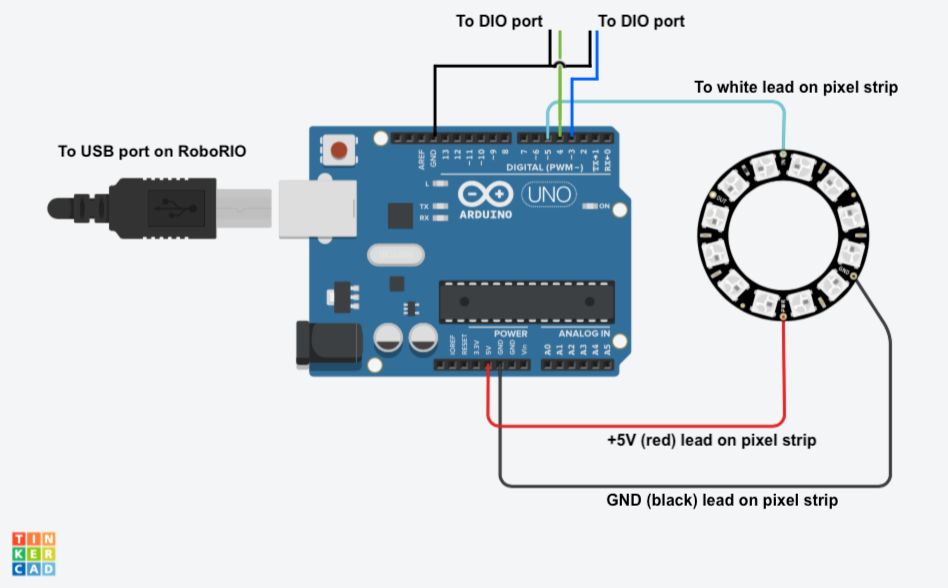

# LED

Arduino code for the "RGB pixels" (e.g. neopixels) LEDs on our bot. 

"blinkies" is the project we're using for the bot. It shows random color palettes while the bot is not active, then the alliance color during the game. 

* RoboRio sends high/low signals over inputs 3 & 4 on the arduino.
* Code switches on those pin states:
	* If both low/off - random palettes
	* If one high - all solid red
	* If the other high - all solid blue
	* If both high - all off / black 

See comments in the project code for further details.

### Usage notes

You'll need the FastLED library installed. We have found that installing it via the IDE was the only way to make it work.  In the Arduino IDE, choose Sketch > Include Library > Manage Libraries. Then, search for and include FastLED.

This is the circuit layout we're using:



You may need to update some of the values in the ino file to match your setup.

```c
// UPDATE THESE VALUES TO MATCH YOUR SETUP
// 
// define pins that receive high/low values from Rio
int inputPin3 = 3;
int inputPin4 = 4;
// Data pin that led data will be written out to the LEDs over
#define DATA_PIN 5
// How many leds are in the strip?
#define NUM_LEDS 94
// don't go above about 60 if you're powering off the power 5v
// lead on the power distr. panel instead of USB
#define BRIGHTNESS  200        // range of 0 - 255 
#define LED_TYPE    WS2812B    // our pixel strip type

```

In our robot.java file, we add this code to control the LEDs according to the field management system:

```java
public void autonomousInit() {
  setLights();
  ...
}

public void setLights() {
  alliance = DriverStation.getInstance().getAlliance().toString();
  if (alliance == "Red") {
    RobotMap.dio8.set(false);
    RobotMap.dio9.set(true);
  } else if (alliance == "Blue") {
    RobotMap.dio8.set(true);
    RobotMap.dio9.set(false);
  } else {
    RobotMap.dio8.set(true);
    RobotMap.dio9.set(true);
  }
}

```

### Background info

The FastLED project is at https://github.com/FastLED/FastLED

Background info on how RGB "pixel" (addressable LED strips) work can be found at https://docs.google.com/document/d/1kS5UGXYoc85QVdPiJfxRqpg7cZpuU3gIULq6Q6EKniA/edit?hl=en 

